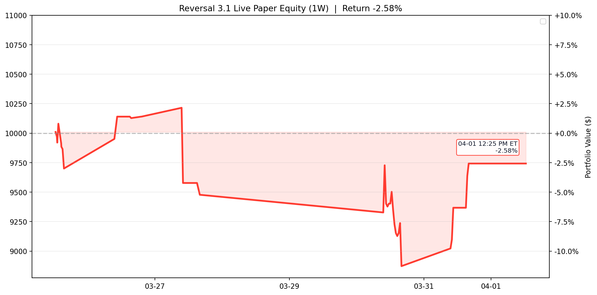

# Reversal 3.1

<!-- reversal-3.1-live:start -->
## Reversal 3.1 Live Paper Test

- Last updated (ET): `2026-04-01 12:25:05 EDT`
- Equity: `$9,742.50` | Realized: `$-257.50` | Unrealized: `$0.00` | Open positions: `0`
- Today closed trades: `0`
- Current slot: `manage_1230`
- Universe: `qqq_plus_leverage_etfs`
- Chart: trailing `1W` with ET timestamps

_None_



- [Full live dashboard](results/reversal_3_1_live/README.md)
- [Live trades csv](results/reversal_3_1_live/live_trades.csv)
- [Live equity csv](results/reversal_3_1_live/live_equity.csv)
<!-- reversal-3.1-live:end -->

`Reversal3.1.ipynb` is the current research notebook for short-term reversal analysis and option profitability confidence estimation.

`Reversal3.1.ipynb` 是当前版本的研究型 notebook，用于短期反转研究和期权盈利概率评估。

Update note: Reversal 3.1 keeps the Reversal 2.5 execution rules unchanged, but upgrades the official universe from `qqq_only_filtered` to `qqq_plus_leverage_etfs` by adding a curated `SOXL + UPRO` overlay after a controlled leveraged-ETF comparison. The live paper runner now uses the same upgraded ticker list.

更新说明：Reversal 3.1 保留 Reversal 2.5 的执行规则不变，但在受控的 leveraged ETF 对比实验之后，把官方 universe 从 `qqq_only_filtered` 升级为 `qqq_plus_leverage_etfs`，即在原有 QQQ 核心上加入精选的 `SOXL + UPRO` overlay；live paper runner 也同步切到了这份新 ticker list。

`Reversal2.5.3.ipynb`、`Reversal2.5.ipynb`、`Reversal2.4.ipynb`、`Reversal2.3.3.ipynb`、`Reversal2.3.2.ipynb`、`Reversal2.3.1.ipynb`、`Reversal2.3.ipynb`、`Reversal2.2.1.ipynb`、`Reversal2.1.ipynb` and `Reversal2.0.ipynb` are preserved as earlier version snapshots.

`Reversal2.5.3.ipynb`、`Reversal2.5.ipynb`、`Reversal2.4.ipynb`、`Reversal2.3.3.ipynb`、`Reversal2.3.2.ipynb`、`Reversal2.3.1.ipynb`、`Reversal2.3.ipynb`、`Reversal2.2.1.ipynb`、`Reversal2.1.ipynb` 和 `Reversal2.0.ipynb` 作为更早版本快照保留。


## Featured Result | 重点结果

The official Reversal 3.1 backtest definition keeps the Reversal 2.5 execution logic intact, including the dynamic trade-level filter `matched_signals >= 10`, the promoted `60d` historical lookback window, and the `minimum current drop > 0.5%` entry filter. The only promoted change is the curated universe overlay: `qqq_plus_leverage_etfs = qqq_only_filtered + SOXL + UPRO`. On the current data snapshot, the official Reversal 3.1 result is `+1709.09%` total return, `-44.30%` max drawdown, `63.33%` win rate, and `4.28` Sharpe.

Reversal 3.1 的官方回测定义保留了 Reversal 2.5 的执行逻辑不变，包括动态交易级过滤 `matched_signals >= 10`、提升后的 `60d` 历史观察窗口，以及 `minimum current drop > 0.5%` 入场过滤。唯一被正式提升的变化，是精选的 universe overlay：`qqq_plus_leverage_etfs = qqq_only_filtered + SOXL + UPRO`。在当前数据快照下，官方 Reversal 3.1 结果为：总收益 `+1709.09%`、最大回撤 `-44.30%`、胜率 `63.33%`、Sharpe `4.28`。

Research discipline is documented in `RESEARCH_GUARDRAILS.md`; future upgrades
should be judged against those standards instead of curve quality alone.

研究纪律已写入 `RESEARCH_GUARDRAILS.md`；以后版本升级应按这些标准判断，而不是只看曲线是否更好看。

- [Reversal 3.1 equity](results/reversal_3_1/reversal_3_1_call_backtest_equity.csv)
- [Reversal 3.1 trades](results/reversal_3_1/reversal_3_1_call_backtest_trades.csv)
- [Reversal 3.1 plot](assets/reversal_3_1_call_backtest_equity.png)


## Optimization Path | 优化路径

The current strategy structure is intentionally sequential:

当前策略优化逻辑是明确分阶段推进的：

1. Select the best universe first.  
   先确定最优 universe。
2. Hold that universe fixed.  
   固定 universe，不再混入新的 universe 变化。
3. Compare factor / signal refinements on top of the chosen universe.  
   在选定 universe 之上比较新的因子或信号改造。
4. Promote the best-performing factor into the next official version.  
   把表现最好的因子升级为下一个正式版本。
5. Re-open the universe only when a controlled overlay experiment beats the official setup across more than one horizon.  
   只有当受控 overlay 实验在多个观察周期上都优于官方设定时，才重新打开 universe 层做升级。

### Stage 1: Universe Selection | 第一阶段：选 Universe

Reversal 2.3.3 compared five universes under the original dynamic `matched_signals >= 10` rule. The conclusion was clear: `qqq_only_filtered` remained the best universe and is therefore preserved in Reversal 2.5.3.

Reversal 2.3.3 在原始动态 `matched_signals >= 10` 规则下比较了五组 universe，结论非常明确：`qqq_only_filtered` 仍然最优，因此在 Reversal 2.5.3 中被保留。

- [reversal_2_3_3_universe_comparison.csv](results/reversal_2_3_3_universe_comparison/reversal_2_3_3_universe_comparison.csv)
- Sharpe uses the U.S. 10Y Treasury yield on `2026-03-16` (`4.23%`) as the annual risk-free rate.

| Universe | Usable Tickers | Win Rate | Return | Max DD | Sharpe | Equity Output | Trade Output |
|---|---:|---:|---:|---:|---:|---|---|
| `qqq_only_filtered` | `97` | `59.02%` | `+552.91%` | `-32.46%` | `2.93` | [equity](results/reversal_2_3_3_universe_comparison/qqq_only_filtered_equity.csv) | [trades](results/reversal_2_3_3_universe_comparison/qqq_only_filtered_trades.csv) |
| `legacy_watchlist_11` | `10` | `54.15%` | `+81.27%` | `-31.57%` | `1.18` | [equity](results/reversal_2_3_3_universe_comparison/legacy_watchlist_11_equity.csv) | [trades](results/reversal_2_3_3_universe_comparison/legacy_watchlist_11_trades.csv) |
| `qqq_spy_filtered` | `501` | `53.53%` | `+54.38%` | `-43.24%` | `0.91` | [equity](results/reversal_2_3_3_universe_comparison/qqq_spy_filtered_equity.csv) | [trades](results/reversal_2_3_3_universe_comparison/qqq_spy_filtered_trades.csv) |
| `spy_only_filtered` | `491` | `52.92%` | `+36.28%` | `-43.26%` | `0.73` | [equity](results/reversal_2_3_3_universe_comparison/spy_only_filtered_equity.csv) | [trades](results/reversal_2_3_3_universe_comparison/spy_only_filtered_trades.csv) |
| `nasdaq_spy_filtered` | `1163` | `50.81%` | `-7.10%` | `-50.29%` | `0.23` | [equity](results/reversal_2_3_3_universe_comparison/nasdaq_spy_filtered_equity.csv) | [trades](results/reversal_2_3_3_universe_comparison/nasdaq_spy_filtered_trades.csv) |
| `nasdaq_only_filtered` | `830` | `49.59%` | `-30.21%` | `-50.51%` | `-0.15` | [equity](results/reversal_2_3_3_universe_comparison/nasdaq_only_filtered_equity.csv) | [trades](results/reversal_2_3_3_universe_comparison/nasdaq_only_filtered_trades.csv) |

### Stage 2: Factor Selection | 第二阶段：选 Factor

After fixing the universe as `qqq_only_filtered`, the article-inspired comparison script tested volume rescaling, PCA de-factoring, kappa / s-score filtering, and shorter rolling windows. The `60d` window was the strongest factor upgrade and is therefore promoted into Reversal 2.4.

在把 universe 固定为 `qqq_only_filtered` 之后，论文启发的对比脚本继续测试了成交量 rescaling、PCA 去市场因素、kappa / s-score 过滤以及更短滚动窗口。最终 `60d` 窗口是最强的因子升级，因此被提升为 Reversal 2.4 的正式默认设置。

Note: the stage 2 and stage 3 tables below use refreshed rerun results and include Sharpe ratios computed with the U.S. 10Y Treasury yield on `2026-03-16` (`4.23%`) as the annual risk-free rate.

说明：下面第二、第三阶段的表格都已经切换成最新重跑结果，并加入了 Sharpe ratio；Sharpe 统一使用 `2026-03-16` 的美国 10 年期国债收益率 `4.23%` 作为年化无风险利率。

- [article variants summary](results/reversal_2_4_article_variants/reversal_article_variants_summary.csv)
- [article variants equity](results/reversal_2_4_article_variants/reversal_article_variants_equity.csv)
- [article variants trades](results/reversal_2_4_article_variants/reversal_article_variants_trades.csv)

| Variant | Return | Max DD | Win Rate | Trades | Sharpe |
|---|---:|---:|---:|---:|---:|
| `Window 60d` | `+806.11%` | `-30.56%` | `61.00%` | `241` | `3.41` |
| `Original 2.3.3` | `+552.91%` | `-32.46%` | `59.02%` | `244` | `2.93` |
| `Add Volume` | `+364.25%` | `-37.58%` | `57.32%` | `239` | `2.44` |
| `Window 126d` | `+276.80%` | `-38.62%` | `56.83%` | `227` | `2.18` |
| `Window 252d + Recent Weight` | `+181.17%` | `-30.21%` | `56.31%` | `206` | `1.82` |
| `Kappa / s-score` | `+145.58%` | `-29.95%` | `55.61%` | `214` | `1.61` |
| `PCA Defactored` | `+23.89%` | `-42.39%` | `52.31%` | `216` | `0.60` |


### Stage 3: Minimum Drop Filter | 第三阶段：选 Minimum Drop

After fixing both the universe and the `60d` factor, the next test was whether the live / backtest entry should require a minimum current drop. The `0.5%` threshold was the strongest improvement, so it is promoted into Reversal 2.5 as the new official execution filter.

在把 universe 和 `60d` 因子都固定下来之后，下一步测试的是是否要为 live / backtest 入场增加 minimum current drop 门槛。最终 `0.5%` 阈值表现最好，因此被提升为 Reversal 2.5 的正式执行过滤。

- [minimum drop summary](results/reversal_2_5_min_drop_experiment/reversal_2_5_min_drop_summary.csv)
- [minimum drop equity](results/reversal_2_5_min_drop_experiment/reversal_2_5_min_drop_equity.csv)
- [minimum drop plot](assets/reversal_2_5_min_drop_experiment.png)

| Minimum Drop | Return | Max DD | Win Rate | Trades | Sharpe |
|---|---:|---:|---:|---:|---:|
| `0.0%` | `+806.11%` | `-30.56%` | `61.00%` | `241` | `3.41` |
| `0.5%` | `+1305.60%` | `-30.84%` | `62.08%` | `240` | `3.96` |
| `1.0%` | `+594.68%` | `-24.79%` | `60.44%` | `225` | `3.11` |
| `2.0%` | `+485.14%` | `-22.05%` | `62.13%` | `169` | `3.20` |
| `3.0%` | `+77.61%` | `-15.15%` | `60.00%` | `70` | `1.68` |
| `4.0%` | `+3.56%` | `-18.19%` | `52.38%` | `21` | `0.06` |


### Stage 4: Leveraged ETF Overlay | 第四阶段：精选 Leveraged ETF Overlay

After fixing the `60d` factor and the `minimum current drop > 0.5%` filter, the next question was whether a very small number of leveraged ETFs should be allowed into the official universe. The research result was narrower than the original intuition: adding `SOXL` and `UPRO` consistently improved `1Y`, `2Y`, and `3Y` results, while `TQQQ` did not add stable incremental benefit once those two were already present. Reversal 3.1 therefore promotes a curated overlay, not a broad leveraged-ETF bucket.

在把 `60d` 因子和 `minimum current drop > 0.5%` 过滤都固定下来之后，下一步研究的问题是：是否应该允许极少数 leveraged ETF 进入官方 universe。结果比最初的直觉更窄：`SOXL` 和 `UPRO` 在 `1Y`、`2Y`、`3Y` 上都稳定改善了结果，而 `TQQQ` 在加入这两只之后并没有继续带来稳定增益。因此 Reversal 3.1 提升的是一个精选 overlay，而不是泛化的 leveraged ETF 大篮子。

- [leveraged ETF summary](results/reversal_3_1_leveraged_etf_experiment/reversal_3_1_leveraged_etf_summary.csv)
- [leveraged ETF robustness](results/reversal_3_1_leveraged_etf_experiment/reversal_3_1_leveraged_etf_robustness.csv)
- [leveraged ETF equity comparison](results/reversal_3_1_leveraged_etf_experiment/reversal_3_1_leveraged_etf_equity.csv)
- [leveraged ETF plot](assets/reversal_3_1_leveraged_etf_experiment.png)

| Variant | 1Y Return | 1Y Max DD | 1Y Win Rate | 1Y Sharpe |
|---|---:|---:|---:|---:|
| `baseline_qqq_only_filtered` | `+1136.44%` | `-44.17%` | `61.67%` | `3.76` |
| `plus_tqqq` | `+1148.88%` | `-44.13%` | `61.67%` | `3.78` |
| `plus_soxl` | `+1552.12%` | `-44.20%` | `62.92%` | `4.16` |
| `plus_upro` | `+1271.12%` | `-44.07%` | `62.08%` | `3.90` |
| `plus_soxl_upro` | `+1709.09%` | `-44.30%` | `63.33%` | `4.28` |
| `plus_tqqq_soxl_upro` | `+1707.90%` | `-44.30%` | `63.33%` | `4.28` |


## License | 版权

This repository is released under an explicit `All Rights Reserved` copyright
notice. It is not an open-source project, and reuse, copying, modification,
distribution, or derivative work creation requires prior written permission.

本仓库采用明确的 `All Rights Reserved` 版权声明，并非开源项目；复制、修改、分发、
再发布或基于本仓库创建衍生作品，均需事先获得书面许可。

## Overview | 项目简介

This project focuses on identifying large intraday drawdowns, evaluating whether prices reverse over the next few trading days, and estimating the return distribution of related call-option trades.

本项目主要研究三件事：识别日内大幅下跌、评估未来几个交易日内的价格反转概率，以及估计相关看涨期权交易的收益分布。

The notebook works from CSV files stored under `reversal_data/`, Reversal 2.3 adds a dynamic universe builder, Reversal 2.3.1 adds a staged-entry options backtest plus universe-comparison scripts, Reversal 2.3.2 defaults the research flow to `qqq_only_filtered` with an in-notebook data-refresh step, Reversal 2.3.3 adds minimum-sample filtering plus top-15 ranked output, Reversal 2.4 promotes the `60d` observation window into the default research and official backtest setup, Reversal 2.5 adds the `minimum current drop > 0.5%` entry filter, Reversal 2.5.1 improves spot-price handling by preferring extended-hours prices when available, Reversal 2.5.2 adds current ATM call IV plus 20d rolling sigma to the live screener output, Reversal 2.5.3 consolidates that live screener into a cleaner single-table layout, and Reversal 3.1 upgrades the official universe to `qqq_plus_leverage_etfs = qqq_only_filtered + SOXL + UPRO`.

Notebook 通过 `reversal_data/` 目录下的 CSV 数据运行；Reversal 2.3 新增了动态股票池构建器，Reversal 2.3.1 新增了分批建仓的回测和股票池横向比较脚本，Reversal 2.3.2 把默认研究流程切到 `qqq_only_filtered` 并在 notebook 内加入了数据刷新步骤，Reversal 2.3.3 进一步加入了最小样本过滤和前 15 名输出，Reversal 2.4 把 `60d` 观察窗口正式提升为默认研究与官方回测设定，Reversal 2.5 加入了 `minimum current drop > 0.5%` 入场过滤，Reversal 2.5.1 把 spot 取价改成优先使用扩展时段价格，Reversal 2.5.2 把当前 ATM call IV 和 20d rolling sigma 接进了 live screener 输出，Reversal 2.5.3 把 live screener 的展示压缩成更清晰的单表布局，而 Reversal 3.1 则把官方 universe 升级为 `qqq_plus_leverage_etfs = qqq_only_filtered + SOXL + UPRO`。

Before running the main analysis notebook, you can use `update_reversal_csv.ipynb` to download and refresh the input CSV files.

在运行主分析 notebook 之前，可以先使用 `update_reversal_csv.ipynb` 下载并更新输入用的 CSV 数据。

## Workflow | 推荐流程

1. Run `update_reversal_csv.ipynb` to download or refresh market data into `reversal_data/`.  
   先运行 `update_reversal_csv.ipynb`，把市场数据下载或更新到 `reversal_data/`。
2. Run `Reversal3.1.ipynb` for QQQ-plus-overlay universe construction, reversal success analysis, in-notebook CSV refresh, live setup screening, call-entry planning, option confidence intervals, GBM simulation, and rolling sigma plots.  
   再运行 `Reversal3.1.ipynb`，完成带精选 leveraged ETF overlay 的股票池构建、反转成功率分析、notebook 内 CSV 刷新、实时 setup 筛选、call 入场规划、期权置信区间、GBM 模拟和滚动波动率可视化。
3. Run `backtest_reversal_3_1_calls.py` for the official Reversal 3.1 call backtest under `qqq_plus_leverage_etfs + matched_signals >= 10 + 60d + minimum current drop > 0.5%`.  
   如果你想跑官方 Reversal 3.1 主回测，再运行 `backtest_reversal_3_1_calls.py`；这部分使用 `qqq_plus_leverage_etfs + matched_signals >= 10 + 60d + minimum current drop > 0.5%`。
4. Run `compare_reversal_2_3_3_universes.py` if you want to revisit the universe-selection stage under the original dynamic `matched_signals >= 10` filter.  
   如果你想回看 universe 选择阶段，再运行 `compare_reversal_2_3_3_universes.py`；这部分使用原始动态 `matched_signals >= 10` 过滤。
5. Run `backtest_reversal_article_variants.py` if you want to reproduce the article-inspired factor comparison that selected the `60d` window.  
   如果你想复现论文启发的因子对比并验证为什么最终选择 `60d` 窗口，再运行 `backtest_reversal_article_variants.py`。
6. Run `backtest_reversal_2_5_min_drop_experiment.py` if you want to reproduce the minimum-drop threshold sweep that selected the `0.5%` filter.  
   如果你想复现 minimum-drop 阈值比较，并验证为什么最终选择 `0.5%` 过滤，再运行 `backtest_reversal_2_5_min_drop_experiment.py`。
7. Read `RESEARCH_GUARDRAILS.md` before promoting any new factor, threshold, or story into an official version.  
   如果你想把新的因子、阈值或叙事升级成正式版本，先读 `RESEARCH_GUARDRAILS.md`。
8. Run `reversal_3_1_live.py` if you want the no-lookahead live paper-test pipeline with scheduled entry / exit scans and auto-generated GitHub dashboard files.  
   如果你想启用无未来函数的 live paper-test，并定时更新 GitHub dashboard，就运行 `reversal_3_1_live.py`。

## Notebook Contents | Notebook 内容

1. `Probability of Success Reversal`  
   Measures how often a ticker recovers after a large intraday drop using CSV data under `reversal_data/`.  
   使用 `reversal_data/` 中的 CSV 数据，统计个股在出现较大日内跌幅后，未来若干交易日内发生反弹的成功率。

2. `QQQ Plus Leveraged ETF Universe Builder`  
   Builds the default `qqq_plus_leverage_etfs` candidate pool from local QQQ constituents, filtered by minimum market cap and price, then adds the curated `SOXL + UPRO` overlay.  
   基于本地 QQQ 成分股构建默认的 `qqq_plus_leverage_etfs` 候选池，并在最小市值和股价过滤之后，加入精选的 `SOXL + UPRO` overlay。

3. `Live Reversal Setup Screener`  
   Uses today's near-real-time price to infer the current intraday drawdown for each ticker, applies an optional minimum current-drop filter, then measures how often similar or worse historical drops recovered a user-defined fraction of the signal-day drawdown within the next N trading days.  
   使用当日近实时价格推断每个 ticker 当前的日内跌幅，可选地叠加 minimum current-drop 过滤，再回看过去一段观察窗口内“至少同等严重”的历史下跌日，统计未来 N 个交易日内回补 signal-day 跌幅指定比例的成功率。

4. `Option Execution Planner for Call Entries`  
   Pulls option chains for the chosen ticker, filters toward near-ATM calls in the 21-40 trading-day range, and translates the strategy into reference entry, take-profit, and stop-loss levels.  
   拉取所选 ticker 的期权链，筛选 21-40 个交易日范围内、接近 ATM 的 call，并把策略转成参考入场价、止盈价和止损价。

5. `Black Scholes Methods for Profitability Confidence Interval`  
   Estimates option profitability confidence with a Black-Scholes pricing framework and bootstrap simulations.  
   结合 Black-Scholes 定价框架和 bootstrap 模拟，估计期权策略收益区间及其置信水平。

6. `Geometric Brownian Motion Methods for Profitability Confidence Interval`  
   Simulates option outcomes with GBM paths under configurable drift and volatility assumptions.  
   在可调的漂移率和波动率假设下，使用几何布朗运动模拟期权收益结果。

7. `Rolling Sigma`  
   Plots rolling annualized volatility for selected tickers.  
   绘制所选股票的滚动年化波动率曲线。

## Data Layout | 数据结构

Place per-ticker CSV files in:

请将每个股票对应的 CSV 文件放在以下目录中：

```text
reversal_data/
  SOXL.csv
  UPRO.csv
  ...
```

The notebook expects columns such as `Date`, `Open`, `High`, `Low`, `Adj Close`, and `Max Drop`.

Notebook 默认读取的主要字段包括 `Date`、`Open`、`High`、`Low`、`Adj Close` 和 `Max Drop`。

`update_reversal_csv.ipynb` is designed to generate these CSV files automatically from Yahoo Finance data.

`update_reversal_csv.ipynb` 的用途就是从 Yahoo Finance 自动生成这些 CSV 文件。

## Dependencies | 依赖环境

Install the Python packages used in the notebook:

安装 notebook 所需的 Python 包：

```bash
pip install numpy pandas matplotlib scipy yfinance notebook
```

## Usage | 使用方法

Open the notebook from the repository root so `Path.cwd()` resolves correctly:

请在仓库根目录打开 notebook，这样 `Path.cwd()` 才会正确指向项目目录：

```bash
jupyter notebook Reversal3.1.ipynb
```

To refresh the CSV data first, open:

如果你想先更新 CSV 数据，可以打开：

```bash
jupyter notebook update_reversal_csv.ipynb
```

Update the user-config sections inside each code cell to change:

你可以在各代码单元的用户配置区修改以下参数：

- Tickers | 股票列表
- Drop threshold, minimum current drop, and recovery target | 下跌触发阈值、minimum current drop 与反弹目标
- Strike, call cost, expiry date | 行权价、期权成本、到期日
- Confidence level, risk-free rate, bootstrap count | 置信水平、无风险利率、bootstrap 次数
- GBM path count and volatility method | GBM 路径数与波动率设定方式

For `update_reversal_csv.ipynb`, the main configurable inputs are:

对于 `update_reversal_csv.ipynb`，主要可调参数包括：

- Tickers | 股票列表
- Start date and end date | 数据起止日期
- Output directory | 输出目录

## Repository Files | 仓库文件

- `update_reversal_csv.ipynb` | Download and prepare CSV market data before analysis. | 在分析前下载并整理 CSV 市场数据。
- `update_reversal_data.py` | Refresh the default `qqq_plus_leverage_etfs` CSV datasets from Yahoo Finance. | 从 Yahoo Finance 刷新默认的 `qqq_plus_leverage_etfs` 所需 CSV 数据。
- `RESEARCH_GUARDRAILS.md` | Default research discipline for avoiding curve sculpting, weak narratives, and LLM-assisted overfitting. | 默认研究守则，用于避免曲线雕刻、伪机制叙事和 LLM 放大的过拟合。
- `reversal_3_1_live.py` | Reversal 3.1 live paper-test runner with scheduled entry/exit logic, state persistence, dashboard generation, optional GitHub publishing, and the promoted `qqq_plus_leverage_etfs` live universe. | Reversal 3.1 的 live paper-test 主脚本，包含定时入场/离场逻辑、状态持久化、dashboard 生成、可选的 GitHub 发布，以及升级后的 `qqq_plus_leverage_etfs` live universe。
- `Reversal3.1.ipynb` | Current main notebook with the official `qqq_plus_leverage_etfs` universe, the default `60d` observation window, `minimum current drop > 0.5%` live-screen filter, improved extended-hours spot pricing, ATM-IV versus rolling-sigma context, and a cleaner single-table live screener output. | 当前主 notebook，使用官方 `qqq_plus_leverage_etfs` universe，默认 `60d` 观察窗口，加入 `minimum current drop > 0.5%` 的 live-screen 过滤，优先使用扩展时段 spot 价格，并在 screener 输出中补充 ATM IV 与 rolling sigma 对照，同时把 live screener 压缩成更清晰的单表输出。
- `Reversal2.5.3.ipynb` | Previous main notebook snapshot before the leveraged-ETF overlay promotion. | 提升 leveraged ETF overlay 之前的上一版主 notebook 快照。
- `Reversal2.5.2.ipynb` | Previous main notebook snapshot before the live screener layout cleanup. | 调整 live screener 展示布局之前的上一版主 notebook 快照。
- `Reversal2.5.ipynb` | Previous main notebook snapshot before the extended-hours spot-pricing fix. | 修正扩展时段 spot 取价逻辑之前的上一版主 notebook 快照。
- `Reversal2.4.ipynb` | Previous main notebook snapshot before the `minimum current drop > 0.5%` promotion. | 升级到 `minimum current drop > 0.5%` 过滤之前的上一版主 notebook 快照。
- `Reversal2.3.3.ipynb` | Previous main notebook snapshot before the `60d` window promotion. | 升级到 `60d` 窗口之前的上一版主 notebook 快照。
- `Reversal2.3.ipynb` | Previous notebook snapshot with the Nasdaq + SPY universe builder. | 上一版本 notebook 快照，包含 Nasdaq + SPY 股票池构建器。
- `Reversal2.2.1.ipynb` | Previous notebook snapshot. | 上一版本 notebook 快照。
- `Reversal2.1.ipynb` | Earlier notebook snapshot. | 更早版本 notebook 快照。
- `Reversal2.0.ipynb` | Earlier notebook snapshot. | 更早版本 notebook 快照。
- `backtest_reversal_2_3_calls.py` | Reversal 2.3 call backtest with top-2 daily ranking, weighted sizing, and broad universe selection. | Reversal 2.3 的 call 回测脚本，包含每日前二打分、加权仓位和广义股票池。
- `backtest_reversal_2_3_1_calls.py` | Reversal 2.3.1 call backtest with staggered 50% entries and up to two concurrent positions. | Reversal 2.3.1 的 call 回测脚本，采用分批 50% 建仓和最多两个同时持仓。
- `backtest_reversal_2_3_3_calls.py` | Official Reversal 2.3.3 call backtest with `qqq_only_filtered` and the original dynamic `matched_signals >= 10` trade gate. | Reversal 2.3.3 的官方 call 回测脚本，默认使用 `qqq_only_filtered`，并沿用最初的动态 `matched_signals >= 10` 交易门槛。
- `backtest_reversal_2_4_calls.py` | Official Reversal 2.4 call backtest with the promoted `60d` observation window. | Reversal 2.4 的官方 call 回测脚本，使用提升后的 `60d` 观察窗口。
- `backtest_reversal_2_5_calls.py` | Official Reversal 2.5 call backtest with the promoted `60d` observation window and `minimum current drop > 0.5%` filter. | Reversal 2.5 的官方 call 回测脚本，使用提升后的 `60d` 观察窗口和 `minimum current drop > 0.5%` 过滤。
- `backtest_reversal_3_1_calls.py` | Official Reversal 3.1 call backtest with the curated `qqq_plus_leverage_etfs` overlay, the promoted `60d` observation window, and the `minimum current drop > 0.5%` filter. | Reversal 3.1 的官方 call 回测脚本，使用精选的 `qqq_plus_leverage_etfs` overlay、提升后的 `60d` 观察窗口和 `minimum current drop > 0.5%` 过滤。
- `backtest_reversal_3_1_leveraged_etf_experiment.py` | Controlled leveraged-ETF overlay comparison across `TQQQ`, `SOXL`, `UPRO`, and their combinations on top of the official 2.5 setup. | 受控的 leveraged ETF overlay 比较脚本，在官方 2.5 设定之上测试 `TQQQ`、`SOXL`、`UPRO` 及其组合。
- `backtest_reversal_article_variants.py` | Article-inspired factor comparison across volume, PCA, kappa / s-score, and rolling-window variants. | 论文启发的因子比较脚本，横向测试成交量、PCA、kappa / s-score 和不同滚动窗口。
- `backtest_reversal_2_5_min_drop_experiment.py` | Minimum-drop threshold comparison that tests `0.0%` through `4.0%` filters on top of the `60d + qqq_only_filtered` setup. | minimum-drop 阈值比较脚本，在 `60d + qqq_only_filtered` 设定上测试 `0.0%` 到 `4.0%` 的过滤门槛。
- `compare_reversal_2_3_1_universes.py` | Compare Reversal 2.3.1 across multiple ticker-list universes. | 比较 Reversal 2.3.1 在多个股票池下的表现。
- `compare_reversal_2_3_3_universes.py` | Official five-universe comparison under Reversal 2.3.3 using the dynamic `matched_signals >= 10` filter. | Reversal 2.3.3 下的官方五组 universe 对比脚本，使用动态 `matched_signals >= 10` 过滤。
- `reversal_universe.py` | Shared universe builder used by notebook, backtest, and live paper trading, including the curated `qqq_plus_leverage_etfs` preset. | notebook、回测和 live paper trading 共用的 universe 构建模块，包含精选的 `qqq_plus_leverage_etfs` preset。
- `qqq_plus_leverage_etfs_tickers.csv` | Saved ticker list for the promoted Reversal 3.1 universe overlay. | Reversal 3.1 官方 overlay universe 的保存版 ticker 列表。
- `spy_tickers.txt` | Local SPY constituents source used when building the broad universe. | 构建广义股票池时使用的本地 SPY 成分股文件。
- `qqq_tickers.txt` | Local QQQ constituents source used for universe comparison. | 股票池比较时使用的本地 QQQ 成分股文件。
- `README.md` | Project documentation. | 项目说明文件。

## Outputs | 输出结果

Depending on the cell settings, the notebook can generate:

根据不同单元格设置，notebook 可以输出：

- Reversal success-rate comparisons | 反转成功率对比结果
- Option profitability confidence intervals | 期权盈利置信区间
- Rolling sigma charts | 滚动波动率图表
- `success_rate_comparison.png`
