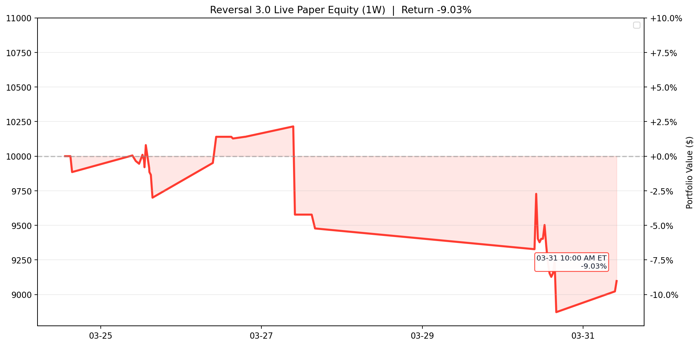

# Reversal 3.0 Live Paper Test

Last updated (ET): `2026-03-31 10:00:05 EDT`
Last processed slot: `manage_1000`

## Active Configuration

- Universe: `qqq_only_filtered`
- Lookback window: `60d`
- Minimum current drop: `> 0.5%`
- Recovery target: `70% of the signal-day drop`
- Success-rate gate: `>= 80%`
- Matched-signal gate: `>= 10`
- Positioning: `50%` target allocation per new entry, up to `2` concurrent tickers
- Entry scan: `3:00 PM ET`
- Exit scans: `9:30 AM ET` and every `30` minutes through `4:00 PM ET`
- Practical live-paper adjustment: entries and exits use the current option mark price; no intraday future path is assumed
- Chart view: default display is trailing `1W`, with latest ET checkpoint annotation and return % axis

## Portfolio Snapshot

- Cash: `$5,527.50`
- Equity: `$9,097.50`
- Realized PnL: `$-1,022.50`
- Unrealized PnL: `$120.00`
- Open positions: `1`

## Open Positions

```text
ticker     contract_symbol entry_trade_date  business_days_held  entry_option_price  current_option_price  entry_spot  current_spot  unrealized_pnl  unrealized_return_pct  success_rate  matched_signals  current_drop_pct  entry_iv_pct  current_iv_pct  rolling_sigma_20d_pct
  FANG FANG260515C00200000       2026-03-30                   1                11.5                  11.9       198.7        201.62           120.0                   3.48         100.0               15              1.56         43.31           42.13                  24.78
```

## Today's Closed Trades (2026-03-31)

_None_

## Current Screener Snapshot

```text
ticker  success_rate_%  matched_signals  current_drop_%  target_rebound_$  target_price  rolling_sigma_20d_%  call_candidate
   AEP           93.75               16            0.68              0.62        130.85                18.09            True
   XEL           92.00               25            0.51              0.28         79.04                18.55            True
 CMCSA           88.46               26            1.11              0.22         28.80                29.21            True
  CHTR           87.80               41            0.52              0.80        220.60                36.22            True
   KDP           85.00               20            0.53              0.10         26.41                21.21            True
   EXC           84.62               13            0.89              0.30         48.98                21.45            True
   PEP           82.35               17            0.79              0.87        156.45                18.39            True
  TMUS           81.25               16            1.30              1.95        213.11                19.67            True
  MDLZ           93.02               43            0.47              0.19         57.67                24.85           False
   LIN           90.00               40            0.15              0.51        499.04                19.51           False
  CTAS           89.47               38            0.33              0.38        168.50                28.24           False
   ADP           84.38               32            0.12              0.17        205.40                25.45           False
```

## Recent Events

```text
                    timestamp_et         slot   event_type                                                                                                                                                                           detail
2026-03-31T09:30:05.890178-04:00 data_refresh data_refresh                                                                                                                                                                    {'saved': 97}
2026-03-30T16:00:01.901878-04:00  manage_1600         exit                                               {"contract_symbol": "HON260501C00225000", "pnl": -600.0, "reason": "stop_loss_hit_at_scan", "return_pct": -13.04, "ticker": "HON"}
2026-03-30T15:00:04.861501-04:00   entry_1500        entry {"allocated_cash": 3450.0, "contract_symbol": "FANG260515C00200000", "contracts": 3, "entry_option_price": 11.5, "matched_signals": 15, "success_rate": 100.0, "ticker": "FANG"}
2026-03-27T15:00:04.241996-04:00   entry_1500        entry    {"allocated_cash": 4600.0, "contract_symbol": "HON260501C00225000", "contracts": 5, "entry_option_price": 9.2, "matched_signals": 20, "success_rate": 100.0, "ticker": "HON"}
2026-03-27T10:00:06.175720-04:00  manage_1000         exit                                             {"contract_symbol": "ABNB260515C00130000", "pnl": -562.5, "reason": "stop_loss_hit_at_scan", "return_pct": -11.42, "ticker": "ABNB"}
2026-03-27T09:30:06.387888-04:00 data_refresh data_refresh                                                                                                                                                                    {'saved': 97}
2026-03-26T15:00:01.983935-04:00   entry_1500        entry {"allocated_cash": 4925.0, "contract_symbol": "ABNB260515C00130000", "contracts": 5, "entry_option_price": 9.85, "matched_signals": 35, "success_rate": 94.29, "ticker": "ABNB"}
2026-03-26T10:30:00.722036-04:00  manage_1030         exit                                                        {"contract_symbol": "FANG260515C00195000", "pnl": 680.0, "reason": "tp_day1_scan", "return_pct": 13.93, "ticker": "FANG"}
2026-03-26T10:30:00.722036-04:00  manage_1030         exit                                                         {"contract_symbol": "AVGO260515C00320000", "pnl": -540.0, "reason": "stop_scan", "return_pct": -11.88, "ticker": "AVGO"}
2026-03-26T09:30:05.730919-04:00 data_refresh data_refresh                                                                                                                                                                    {'saved': 97}
```

## Equity Curve (1W)

Trailing `1W` window. The latest point is annotated with its exact ET checkpoint time and return %. The right axis shows total return versus the $10,000 start.


