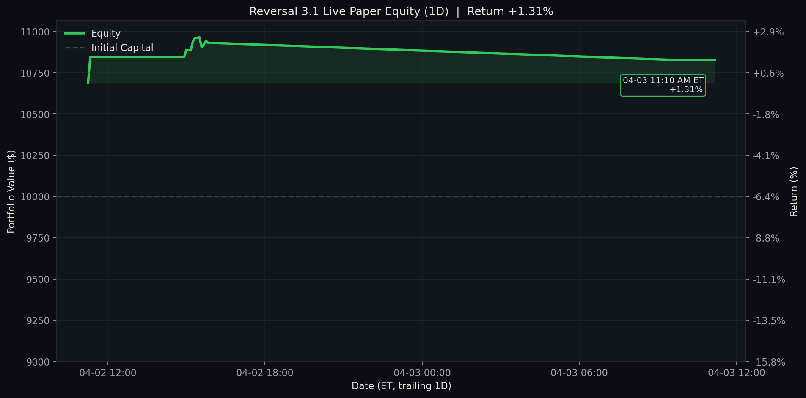
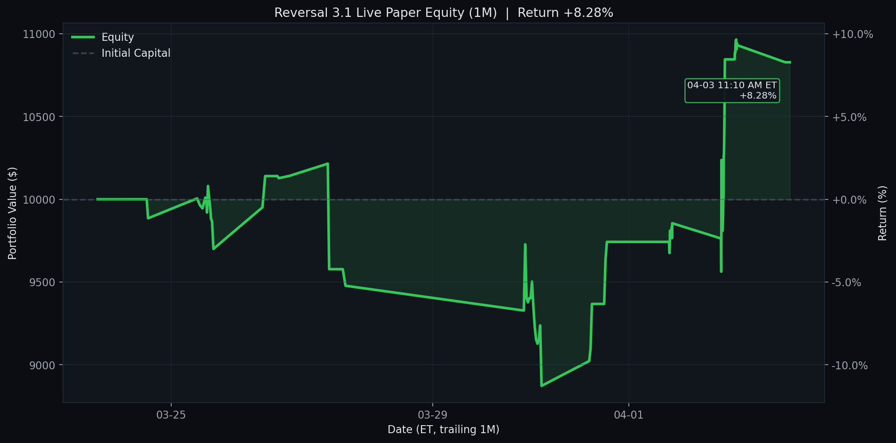

# Reversal 3.1 Live Paper Test

Last updated (ET): `2026-04-03 11:10:05 EDT`
Last processed slot: `manage_1100`

## Active Configuration

- Universe: `qqq_plus_leverage_etfs` (`qqq_only_filtered + SOXL + UPRO`)
- Lookback window: `60d`
- Minimum current drop: `> 0.5%`
- Recovery target: `70% of the signal-day drop`
- Success-rate gate: `>= 80%`
- Matched-signal gate: `>= 10`
- Positioning: `50%` target allocation per new entry, up to `2` concurrent tickers
- Entry scan: `3:00 PM ET`
- Exit scans: `9:30 AM ET` and every `30` minutes through `4:00 PM ET`
- Practical live-paper adjustment: entries and exits use the current option mark price; no intraday future path is assumed
- Chart views: GitHub-native `1D / 1W / 1M`, default open panel is `1W`

## Portfolio Snapshot

- Cash: `$8,102.50`
- Equity: `$10,827.50`
- Realized PnL: `$845.00`
- Unrealized PnL: `$-17.50`
- Open positions: `1`

## Open Positions

```text
ticker    contract_symbol entry_trade_date  business_days_held  entry_option_price  current_option_price  entry_spot  current_spot  unrealized_pnl  unrealized_return_pct  success_rate  matched_signals  current_drop_pct  entry_iv_pct  current_iv_pct  rolling_sigma_20d_pct
   WDC WDC260501C00295000       2026-04-02                   1               27.42                 27.25      294.77         294.2           -17.5                  -0.64         97.22               36              0.99         81.84           82.37                  91.06
```

## Today's Closed Trades (2026-04-03)

_None_

## Current Screener Snapshot

```text
ticker  success_rate_%  matched_signals  current_drop_%  target_rebound_$  target_price  rolling_sigma_20d_%  call_candidate
   WDC           97.22               36            1.19              2.47        296.67                88.18            True
  REGN           93.33               15            2.04             11.10        772.49                27.37            True
  ASML           92.86               14            2.81             26.78       1348.28                51.28            True
  CDNS           90.91               44            0.64              1.25        279.66                25.28            True
  ORLY           88.24               34            0.74              0.48         91.90                22.90            True
   CSX           88.00               25            0.63              0.18         41.36                27.22            True
  KLAC           86.11               36            0.87              9.27       1515.87                55.10            True
  FAST           85.71               21            1.44              0.47         46.43                21.85            True
   KDP           85.71               14            0.97              0.17         25.62                19.41            True
 GOOGL           84.62               39            0.51              1.07        296.93                34.65            True
  AMAT           84.38               32            1.38              3.41        352.34                57.49            True
    MU           83.78               37            0.86              2.22        366.90                81.26            True
```

## Recent Events

```text
                    timestamp_et        slot   event_type                          detail
2026-04-03T11:10:05.895954-04:00 manage_1100 slot_skipped {"reason": "already_processed"}
2026-04-03T11:05:04.971549-04:00 manage_1100 slot_skipped {"reason": "already_processed"}
2026-04-03T11:00:01.980341-04:00 manage_1100 slot_skipped {"reason": "already_processed"}
2026-04-03T10:55:05.892037-04:00 manage_1100 slot_skipped {"reason": "already_processed"}
2026-04-03T10:40:04.893559-04:00 manage_1030 slot_skipped {"reason": "already_processed"}
2026-04-03T10:35:05.890516-04:00 manage_1030 slot_skipped {"reason": "already_processed"}
2026-04-03T10:30:05.969194-04:00 manage_1030 slot_skipped {"reason": "already_processed"}
2026-04-03T10:25:05.901598-04:00 manage_1030 slot_skipped {"reason": "already_processed"}
2026-04-03T10:10:05.909443-04:00 manage_1000 slot_skipped {"reason": "already_processed"}
2026-04-03T10:05:05.895940-04:00 manage_1000 slot_skipped {"reason": "already_processed"}
```

## Equity Curves

Each chart is generated from the same live equity series with no-lookahead marks. The latest point is annotated with its exact ET checkpoint time and return %.

<details>
<summary><strong>1D</strong></summary>



</details>

<details open>
<summary><strong>1W</strong></summary>


</details>

<details>
<summary><strong>1M</strong></summary>



</details>
