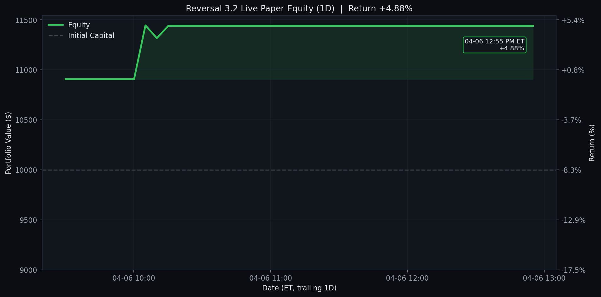
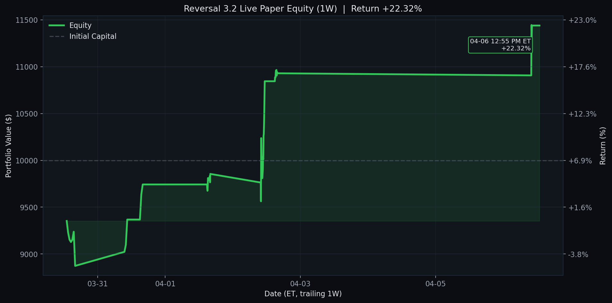
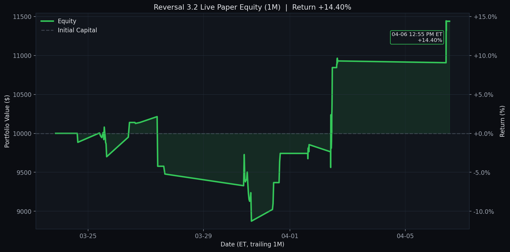

# Reversal 3.2 Live Paper Test

Last updated (ET): `2026-04-06 12:55:05 EDT`
Last processed slot: `manage_1300`

## Active Configuration

- Universe: `qqq_plus_leverage_etfs` (`qqq_only_filtered + SOXL + UPRO`)
- Lookback window: `60d`
- Minimum current drop: `> 0.5%`
- Recovery target: `70% of the signal-day drop`
- Success-rate gate: `>= 80%`
- Matched-signal gate: `>= 10`
- Positioning: `50%` target allocation per new entry, up to `2` concurrent tickers
- Entry scan: `3:00 PM ET`
- Exit scans: `9:30 AM ET` and every `30` minutes through `4:00 PM ET`
- Practical live-paper adjustment: entries and exits use the current option mark price; no intraday future path is assumed
- Chart views: GitHub-native `1D / 1W / 1M`, default open panel is `1W`

## Portfolio Snapshot

- Cash: `$11,440.00`
- Equity: `$11,440.00`
- Realized PnL: `$1,440.00`
- Unrealized PnL: `$0.00`
- Open positions: `0`

## Open Positions

_None_

## Today's Closed Trades (2026-04-06)

```text
ticker    contract_symbol entry_trade_date_et exit_trade_date_et  entry_option_price  exit_option_price   pnl  return_pct                  exit_reason
   WDC WDC260501C00295000          2026-04-02         2026-04-06              27.425             33.375 595.0   21.695533 take_profit_day1_hit_at_scan
```

## Current Screener Snapshot

```text
ticker  success_rate_%  matched_signals  current_drop_%  target_rebound_$  target_price  rolling_sigma_20d_%  call_candidate
   HON          100.00               20            0.75              1.20        228.94                20.57            True
  INTC           94.44               36            0.70              0.25         50.27                73.98            True
  FAST           90.91               33            0.67              0.22         46.21                21.85            True
  AVGO           89.74               39            0.77              1.69        313.83                41.04            True
  ASML           87.10               31            1.13             10.42       1312.76                51.28            True
   LIN           86.67               15            0.94              3.32        501.18                19.40            True
  TSLA           84.21               19            2.76              6.97        357.60                42.35            True
  CTSH           82.86               35            0.68              0.30         62.41                26.11            True
  TTWO           80.65               31            1.46              2.04        198.99                26.67            True
  PANW           80.49               41            0.81              0.92        162.81                41.77            True
  DDOG           80.00               20            3.12              2.63        119.23                49.88            True
   PEP           80.00               20            0.62              0.68        156.72                18.34            True
```

## Recent Events

```text
                    timestamp_et        slot   event_type                          detail
2026-04-06T12:55:05.885407-04:00 manage_1300 slot_skipped {"reason": "already_processed"}
2026-04-06T12:40:05.887169-04:00 manage_1230 slot_skipped {"reason": "already_processed"}
2026-04-06T12:35:05.882900-04:00 manage_1230 slot_skipped {"reason": "already_processed"}
2026-04-06T12:30:05.890457-04:00 manage_1230 slot_skipped {"reason": "already_processed"}
2026-04-06T12:25:05.881954-04:00 manage_1230 slot_skipped {"reason": "already_processed"}
2026-04-06T12:10:05.895326-04:00 manage_1200 slot_skipped {"reason": "already_processed"}
2026-04-06T12:05:05.877929-04:00 manage_1200 slot_skipped {"reason": "already_processed"}
2026-04-06T12:00:03.424842-04:00 manage_1200 slot_skipped {"reason": "already_processed"}
2026-04-06T11:55:05.886057-04:00 manage_1200 slot_skipped {"reason": "already_processed"}
2026-04-06T11:40:05.882469-04:00 manage_1130 slot_skipped {"reason": "already_processed"}
```

## Equity Curves

Each chart is generated from the same live equity series with no-lookahead marks. The latest point is annotated with its exact ET checkpoint time and return %.

<details>
<summary><strong>1D</strong></summary>



</details>

<details open>
<summary><strong>1W</strong></summary>



</details>

<details>
<summary><strong>1M</strong></summary>



</details>
